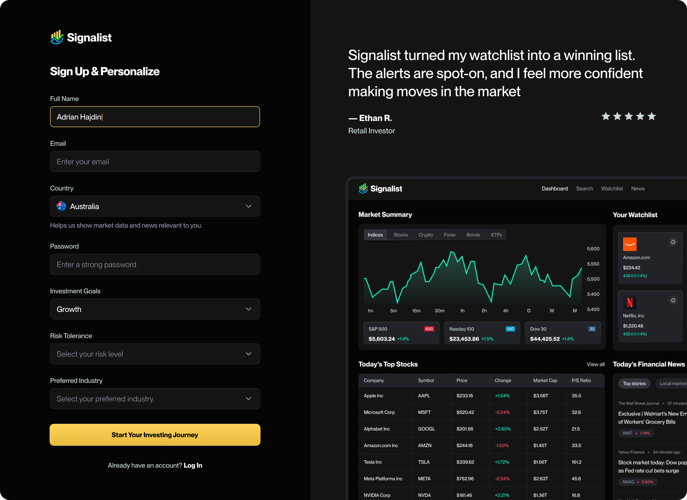
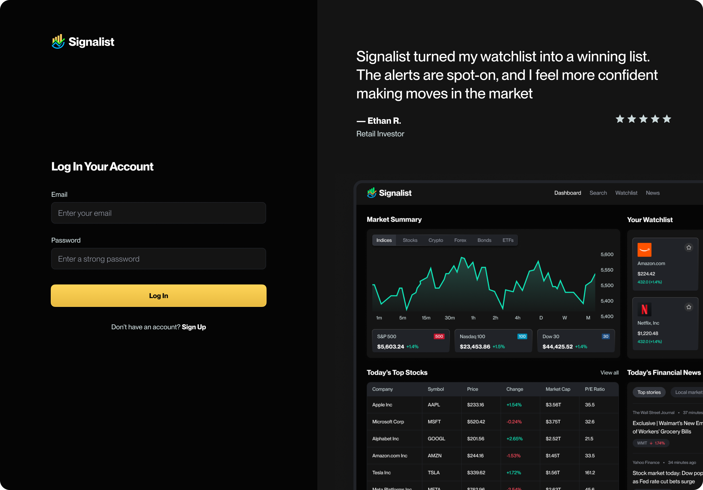
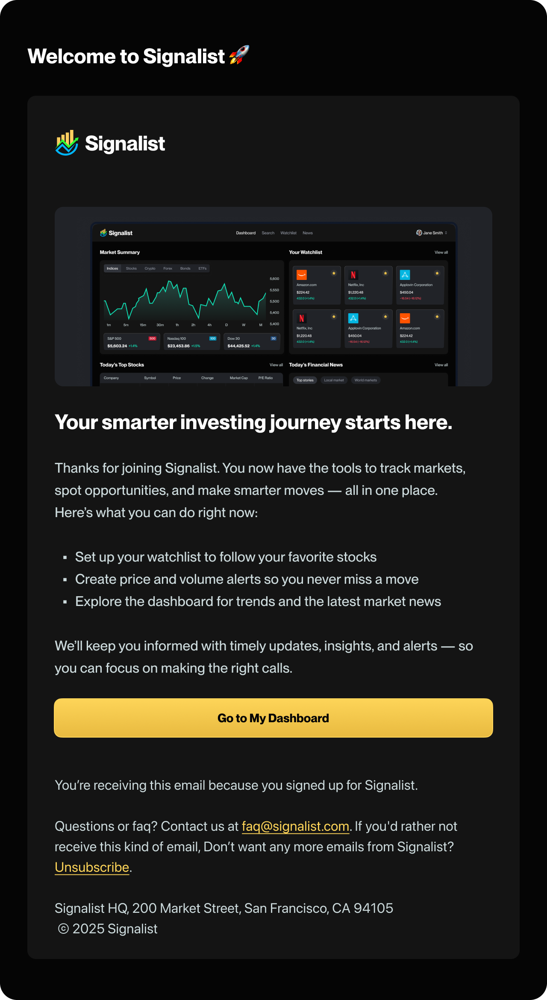
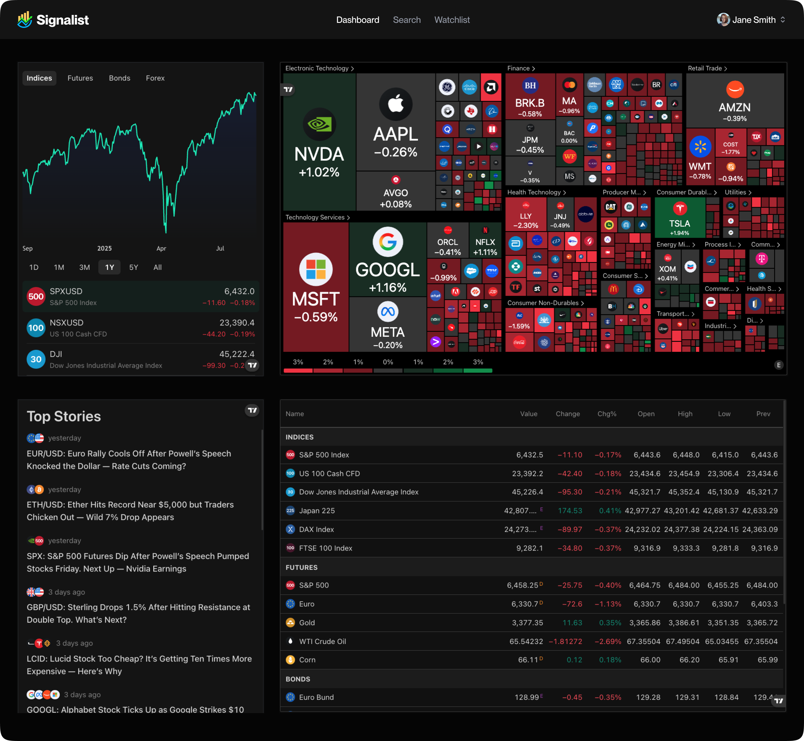
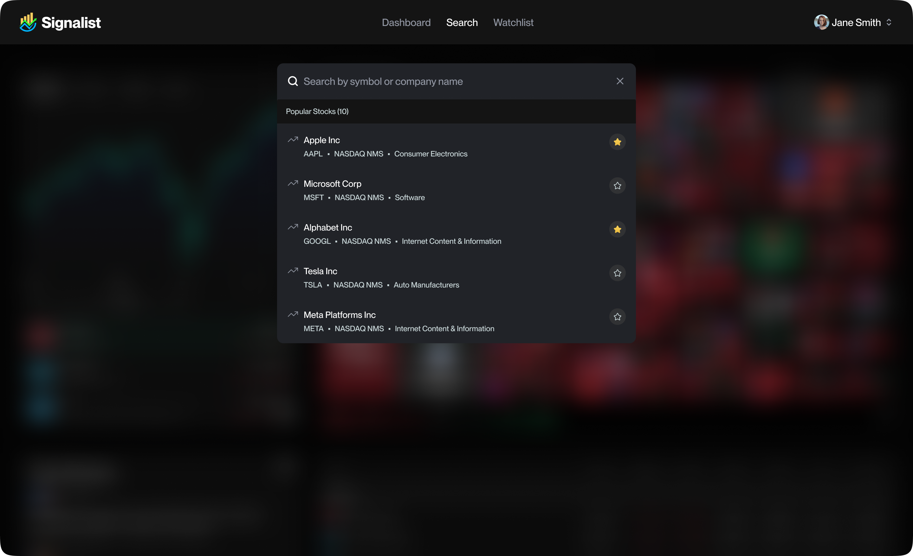
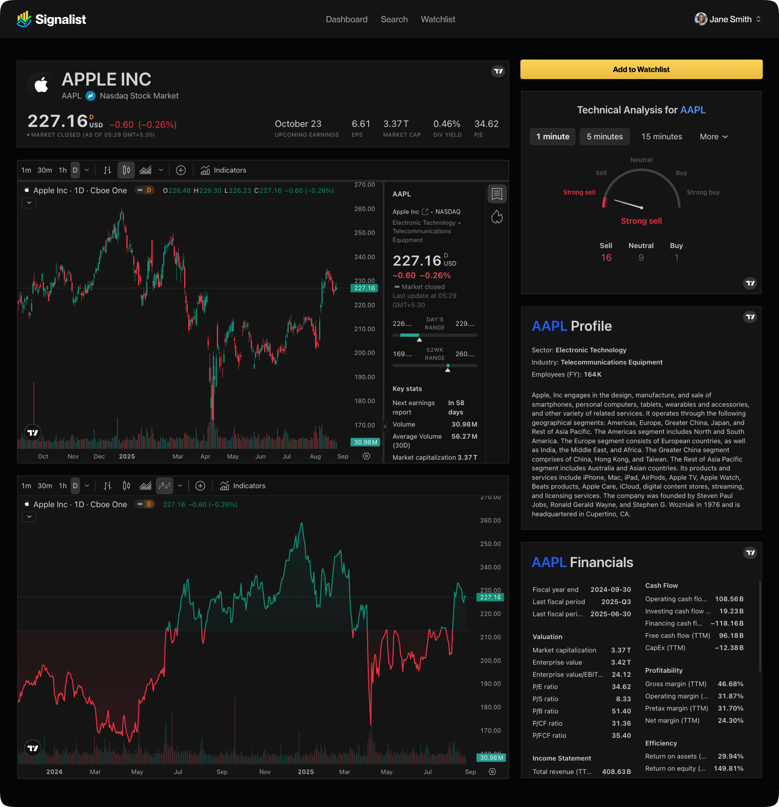
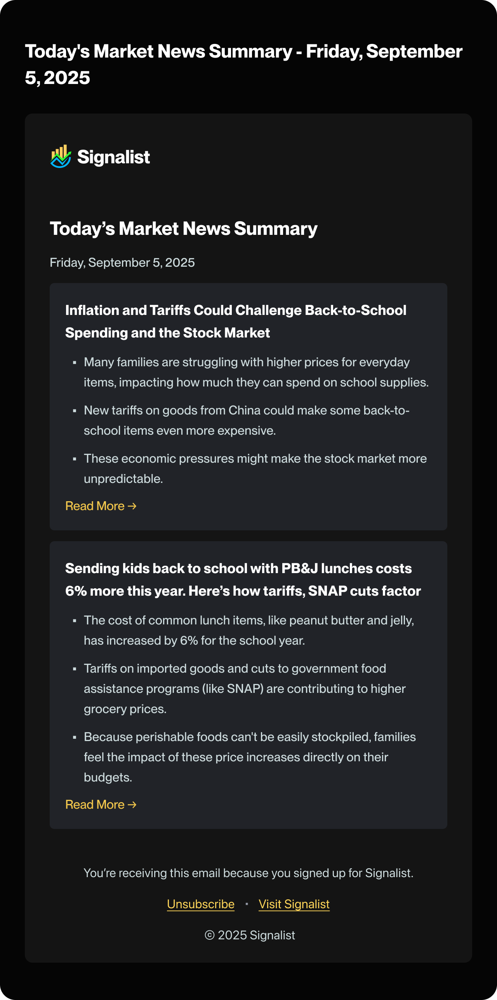

# Signalist 📈
 
By [Elnara Kanybek](https://github.com/ElnaraKanybek)
 
A stock market toolkit — sign up, personalize your investing profile, and get AI-powered market news summaries delivered straight to your inbox.
 
🔗 **[Live Demo](https://signalist-stock-tracker-app-gamma.vercel.app/)** — try it yourself
 
## Overview
 
- [Core Functionality](#core-functionality)
- [Tech Stack](#️-tech-stack)
- [Walkthrough](#️-walkthrough)
- [Credits](#credits)
## Core Functionality
 
- **Authentication** — email/password sign-up and sign-in powered by Better Auth, backed by MongoDB
- **Personalized onboarding** — new users select their country, investment goals, risk tolerance, and preferred industry during sign-up
- **AI-generated welcome emails** — on sign-up, an Inngest background job prompts Gemini to generate a personalized welcome intro based on the user's profile, then emails it via Nodemailer (falls back to a default message if the AI call fails)
- **Live stock search** — debounced search powered by the Finnhub API, with a command palette (⌘K / Ctrl+K) for quick lookup
- **Stock detail pages** — each stock page embeds live TradingView widgets: symbol info, candlestick chart, baseline chart, technical analysis, company profile, and financials
- **Daily AI news summaries** — a scheduled Inngest cron job fetches market news from Finnhub, summarizes it with Gemini, and emails a daily digest to every registered user
- **Responsive dark-themed UI** — built with Tailwind CSS and shadcn/ui components
 
## 🛠️ Tech Stack
 
- [Next.js 15](https://nextjs.org/) (App Router, Turbopack) + TypeScript
- [Tailwind CSS 4](https://tailwindcss.com/) + [shadcn/ui](https://ui.shadcn.com/)
- [MongoDB](https://www.mongodb.com/) + [Mongoose](https://mongoosejs.com/) — data storage
- [Better Auth](https://www.better-auth.com/) — authentication (email/password)
- [Inngest](https://www.inngest.com/) — background jobs and scheduled functions (welcome emails, daily news digest)
- [Google Gemini API](https://ai.google.dev/) — AI-generated email content and news summaries
- [Nodemailer](https://nodemailer.com/) — transactional email delivery via Gmail SMTP
- [Finnhub API](https://finnhub.io/) — stock search, company news, and market news data
- [TradingView Widgets](https://www.tradingview.com/widget/) — embedded charts and financial data
- [React Hook Form](https://react-hook-form.com/) — form state and validation
- Vercel — hosting and deployment
## 🖥️ Walkthrough
 
**Sign Up:**
 

 
New users create an account and personalize their profile — selecting their country, investment goals, risk tolerance, and preferred industry.
 
**Log In:**
 

 
Returning users sign back in with their email and password.
 
**Onboarding:**
 

 
The onboarding step captures each user's investing preferences, which later personalize their AI-generated welcome email.
 
**Dashboard:**
 

 
The home dashboard surfaces a live market overview, stock heatmap, top market stories, and real-time quotes — all powered by embedded TradingView widgets.
 
**Search:**
 

 
A ⌘K/Ctrl+K command palette lets users search for any stock by name or ticker, with debounced live results pulled from the Finnhub API.
 
**Stock Details:**
 

 
Each stock's page combines a candlestick chart, technical analysis, company profile, and financials into one view.
 
**AI News Summary Email:**
 

 
A scheduled background job fetches the day's market news, summarizes it with Gemini, and emails the digest to every registered user each morning.
 
## Credits
 
Stock data and news provided by [Finnhub](https://finnhub.io/). Charts and financial widgets powered by [TradingView](https://www.tradingview.com/). AI content generated via [Google Gemini](https://ai.google.dev/).
